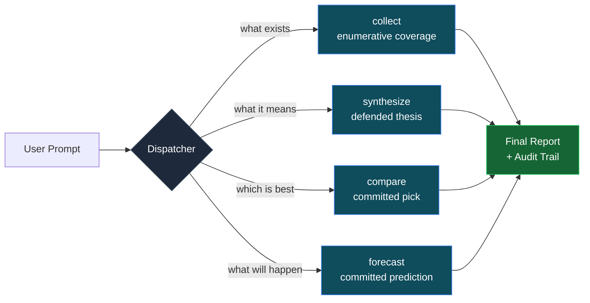
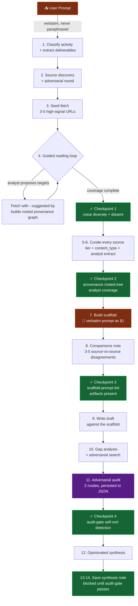
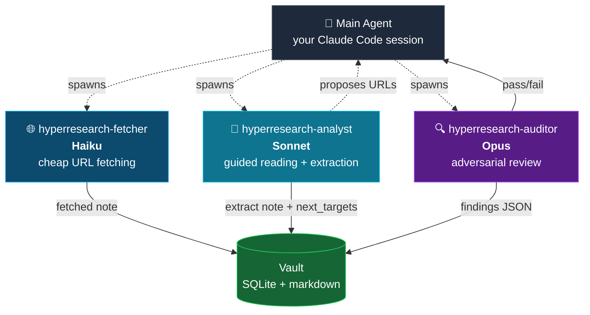
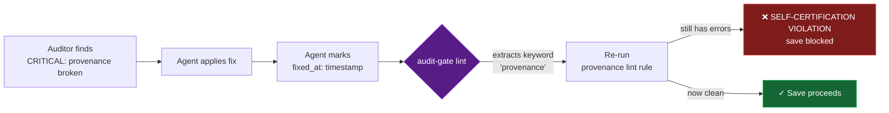

<p align="center">
  
</p>

<h3 align="center">Deep, structured, adversarially-audited research for AI coding agents</h3>

<p align="center">
  <a href="https://pypi.org/project/hyperresearch/"></a>
  <a href="https://pypi.org/project/hyperresearch/"></a>
  <a href="LICENSE"></a>
  <a href="https://github.com/jordan-gibbs/hyperresearch"></a>
</p>

---

Your AI agent searches the web, skims sources, writes an answer that sounds good, and ships it. There's no scaffold, no audit, no source-vs-source comparison, no provenance, no way to know if it actually engaged with the strongest counter-position. Next session, the work is gone.

**Hyperresearch makes research disciplined and persistent.** Every fetched source becomes a markdown note in a Zettelkasten knowledge base. Every research session follows a 14-step protocol with four hard checkpoints. Two adversarial auditor subagents tear the draft apart against the user's verbatim prompt before save is allowed. The user's prompt is gospel — pasted into the scaffold's first section, re-read at every step, machine-checked at the gate.

```bash
pip install hyperresearch
hyperresearch install
```

That's it. In Claude Code: type `/research <topic>`.

---

## The architecture

### One dispatcher, four cognitive activities

Hyperresearch routes every research request by what the output needs to **do**, not what the subject **is**. A query about a fictional franchise can be `collect` (per-character enumeration), `synthesize` (a thesis about meaning), `compare` (this work vs another), or `forecast` (will this sequel succeed). Subject doesn't decide; activity does.



Each modality file encodes only its substance differences (source strategy, writing rules, conformance checks). The shared 14-step protocol — discovery, fetch, curation, scaffold, comparisons, draft, audit, synthesis — lives in one dispatcher. Tight, factored, no duplication.

### The context flow — verbatim prompt is gospel

Every step re-encounters the user's original prompt. It gets pasted verbatim into the scaffold's first section, the auditor reads it at every audit, the save gate machine-checks it. No paraphrasing, no drift.



The four checkpoints are hard gates. **Checkpoint 3** runs `scaffold-prompt` lint that machine-checks the verbatim prompt is in the scaffold's first section. **Checkpoint 4** runs `audit-gate` lint that re-runs the underlying lint rules referenced by every CRITICAL audit finding — if a finding was marked "fixed" but the underlying rule still fails, the gate emits a `SELF-CERTIFICATION VIOLATION` and blocks save. The agent cannot ship a draft that grades its own homework.

### The subagent triad

Hyperresearch ships three registered Claude Code subagents, each picked for its job:



| Agent | Model | Job | Why this model |
|---|---|---|---|
| **hyperresearch-fetcher** | Haiku | Fetches a URL via crawl4ai, persists the note. Mechanical, fast, parallel. | URL fetching is mechanical. Haiku is 10× cheaper. |
| **hyperresearch-analyst** | Sonnet | Reads one source with the research goal in hand, writes a focused extract, proposes 2-5 next targets for the guided loop. | Reasoning about what's relevant + what to read next is real work. Sonnet hits the cost/quality sweet spot for hundreds of source reads per session. |
| **hyperresearch-auditor** | Opus | Runs in two modes (`comprehensiveness` + `conformance`) against the verbatim prompt. Independently re-extracts entities, runs lint rules, persists findings to JSON. | Adversarial review over a long document against multiple criteria is critical reasoning. Worth Opus's ceiling. |

The **guided reading loop** is the engine of deep research: seed-fetch 3-5 URLs → spawn an analyst on each → analysts propose `next_targets` → main agent fetches those WITH `--suggested-by` provenance → loop. Every fetched source carries a wiki-link breadcrumb back to the source that recommended it, so the research graph is a rooted, traceable tree. The provenance lint rule enforces this structurally.

### The audit-gate self-certification detector

The most important quality guarantee in v0.5.0. Two modes of the auditor run sequentially, each persisting findings to `research/audit_findings.json`. The agent applies fixes and marks each CRITICAL `fixed_at: <timestamp>`. The save gate then doesn't trust those marks blindly:



Every CRITICAL with a `fixed_at` timestamp gets its underlying lint rule re-run in the same lint pass. If the rule still returns errors, the agent's "fix" was bookkeeping not substance — and the synthesis save is blocked until the actual vault state matches the claim. The 60+ keyword map covers `provenance`, `analyst-coverage`, `scaffold-prompt`, `workflow`, `uncurated` and natural-language variants. Findings that don't map to any rule emit an advisory warning ("not machine-verified") so the human reviewer sees which findings rest on agent self-report.

---

## What people use it for

- **In-depth topic research** — "What does the literature say about ion-trap quantum scaling?" → 25+ academic sources, 8+ analyst extracts, dissenting voices represented, full provenance graph
- **Comparative evaluation** — "TigerBeetle vs Postgres vs FoundationDB for write-heavy workloads" → per-entity coverage, comparison matrix, committed recommendation, mandatory critical voice on the market leader
- **Forecasting + strategy** — "Will US inflation stay above 3% through 2026?" → ground-truth statistics + institutional analysis + named contrarians, probability language not hedge language, explicit time horizon
- **Interpretive analysis** — "What does Blood Meridian's violence mean?" → primary text + critical tradition + dissenting reading, every paragraph fuses fact with interpretive claim
- **Enumerative coverage** — "For each Napoleonic marshal, cover key campaigns and fate" → per-entity treatment with the 4 fields, no silent downgrades from "each" to "representative examples"
- **Persistent knowledge base** — every source ever fetched stays searchable. Future sessions check the vault before searching the web. Knowledge compounds.

---

## What you get out of the box

```bash
pip install hyperresearch
hyperresearch install
```

That single sequence:

1. Initializes a v6 SQLite vault with FTS5 search at `.hyperresearch/`
2. Auto-installs Chromium for crawl4ai if missing
3. Writes `CLAUDE.md` with the protocol overview
4. Installs the `/research` skill (dispatcher + 4 modality files) to `.claude/skills/hyperresearch/`
5. Registers all 3 subagents (fetcher, analyst, auditor) to `.claude/agents/`
6. Wires PreToolUse hooks into `.claude/settings.json`
7. Sets crawl4ai as the default web provider

You're ready. Type `/research <anything>` in Claude Code.

### What's enforced

- **Verbatim prompt as gospel** — machine-checked via `scaffold-prompt` lint rule
- **Rooted-tree provenance graph** — `--suggested-by` chain must form an actual tree from seeds; isolated breadcrumbs are flagged
- **Analyst coverage** — at least 1 extract per 3 sources (no silent skipping)
- **Adversarial dissent** — Checkpoint 1 requires at least one source explicitly dissents from the dominant view
- **Audit gate self-cert detection** — CRITICAL findings marked fixed must actually be fixed; bookkeeping fixes get caught
- **Save blocked** until audit-gate passes — synthesis cannot ship if any CRITICAL is unresolved
- **Schema integrity** — `tier` and `content_type` are SQLite CHECK-constrained vocabularies; corrupted frontmatter cannot poison the index
- **PDF + raw artifact persistence** — fetched PDFs land in `research/raw/` and the `raw_file` frontmatter field survives all re-serializations

### Key features

- **Real headless browser** — crawl4ai runs local Chromium. JS rendering, bot detection bypass, SPA support. Not an HTTP fetch.
- **Native PDF extraction** — fetched PDFs go through pymupdf, full text extracted, raw file persisted
- **Authenticated crawling** — log into LinkedIn / Twitter / paywalled news once via `hyperresearch setup`; the profile auto-applies on every fetch
- **Junk detection** — captchas, cookie walls, login redirects, binary garbage, error pages all caught and rejected
- **Fetch resilience** — when a high-priority source fails, the agent tries alternative URLs (preprint server, author page, institutional repo), then `--visible` browser, then a summary as fallback. Failures get documented; nothing silently disappears.
- **MCP server** — 13 tools (read + write) for Claude Desktop, Cursor, or any MCP client
- **Note lifecycle** — `draft → review → evergreen → stale → deprecated → archive`
- **Knowledge graph** — `[[wiki-links]]`, backlinks, hub detection, auto-linking
- **FTS5 search** — instant full-text search with BM25 ranking across thousands of notes

---

## Hooks for every major agent

`hyperresearch install` wires into your agent in one step:

| Platform | Hook | Trigger |
|----------|------|---------|
| **Claude Code** | `.claude/settings.json` + `/research` skill + 3 subagents | Before WebSearch, WebFetch |
| **Codex** | `.codex/hooks.json` | Before Bash |
| **Cursor** | `.cursor/rules/hyperresearch.mdc` | Always-apply rule |
| **Gemini CLI** | `.gemini/settings.json` | Before tool calls |

```bash
hyperresearch install --platform all    # Hook every platform at once
```

---

## Commands

```bash
# Research workflow
hyperresearch fetch <url> --tag t -j                       # Fetch a URL into the KB
hyperresearch fetch <url> --suggested-by <id> -j           # Track provenance during the guided loop
hyperresearch fetch <url> --visible -j                     # Bypass bot detection with a visible browser

# Search + read
hyperresearch search "query" -j                            # Full-text search
hyperresearch search "query" --tier ground_truth -j        # Filter by epistemic tier
hyperresearch search "query" --content-type paper -j       # Filter by artifact kind
hyperresearch note show <id> -j                            # Read a note
hyperresearch note show <id> --meta -j                     # Read frontmatter only (cheap triage)
hyperresearch note list --status draft -j                  # List notes with summaries

# Knowledge graph
hyperresearch link --auto -j                               # Auto-link related notes
hyperresearch graph hubs -j                                # Most-connected notes
hyperresearch graph backlinks <id> -j                      # What links to this note

# Health checks
hyperresearch lint -j                                      # Run all rules
hyperresearch lint --rule scaffold-prompt -j               # Verbatim prompt gospel rule
hyperresearch lint --rule provenance -j                    # Rooted-tree breadcrumb chain
hyperresearch lint --rule audit-gate -j                    # Self-certification detector
hyperresearch lint --rule analyst-coverage -j              # Extract:source ratio
hyperresearch repair -j                                    # Fix links, rebuild indexes
```

Every command returns `{"ok": true, "data": {...}}` with `-j`.

---

## Authenticated crawling

Fetch from LinkedIn, Twitter, paywalled sites — anything you can log into:

```bash
hyperresearch setup       # Browser opens. Log into your sites. Done.
```

```toml
# .hyperresearch/config.toml
[web]
provider = "crawl4ai"
profile = "research"
```

LinkedIn, Twitter, Facebook, Instagram, and TikTok automatically use a visible browser to avoid session kills.

---

## Philosophy

- **Process is load-bearing.** A draft without a scaffold, comparisons, audit findings, and a clean provenance graph is unfinished — regardless of how good the prose reads.
- **The user's prompt is the only authority.** Activity classification, source strategy, writing constraints all serve the prompt. Substance rules never override what the user actually asked for.
- **No LLM calls inside the tool.** Hyperresearch stores, indexes, lints, and orchestrates. Your agent is the LLM.
- **Markdown is truth, SQLite is cache.** Notes are plain files. Delete the DB; `hyperresearch sync` rebuilds it.
- **Audit findings are artifacts, not just outputs.** They persist to JSON, get verified by lint rules, and gate the save. Self-certification is structurally prevented.
- **Deeper-not-broader.** v0.5.0 prefers 15 well-extracted sources over 50 skim-fetched ones. The protocol enforces analyst coverage, not source count.

---

## Requirements

- Python 3.11+
- Claude Code (or Codex / Cursor / Gemini CLI) with API access
- Anthropic API key with access to Opus, Sonnet, and Haiku (for the subagent triad)
- Windows, macOS, Linux

---

## License

[MIT](LICENSE)

---

## Star History

[](https://star-history.com/#jordan-gibbs/hyperresearch&Date)
