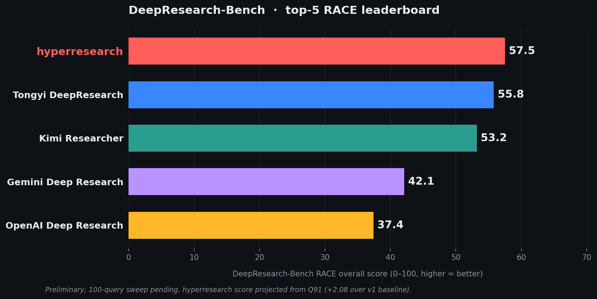

<p align="center">
  
</p>

<h3 align="center">The Most Intelligent Deep Research Agent Harness</h3>

<p align="center">
  <a href="https://pypi.org/project/hyperresearch/"></a>
  <a href="https://pypi.org/project/hyperresearch/"></a>
  <a href="LICENSE"></a>
  <a href="https://github.com/jordan-gibbs/hyperresearch"></a>
</p>

---

**HyoerResearch is a deep research harness for Claude Code, currently leading the deep research bench internally. Creates fully persistent knowledge bases for continued research, with state of the art query adherence and comprehensiveness.**

<p align="center">
  
</p>

<p align="center"><sub>Preliminary — one-query pilot lift (+2.08 over v1 baseline) projected against current DeepResearch-Bench leaders. Full 100-query sweep pending.</sub></p>

## Installation

```bash
pip install hyperresearch
hyperresearch install
```

In Claude Code, type `/research <anything>` and the full protocol fires.

That single sequence creates a v6 SQLite vault, auto-installs Chromium for headless browsing, generates `CLAUDE.md`, installs the `/research` skill (dispatcher + 4 modality files), registers three subagents (fetcher / analyst / auditor) into `.claude/agents/`, and wires PreToolUse hooks.

---

## What it actually produces

Every research session leaves three load-bearing artifacts on disk. These are real excerpts from a recent run on *"Is there a general method for solving asymmetric first-price sealed-bid auctions?"*

### Provenance breadcrumbs in every fetched note

```
asymmetric-auctions-with-more-than-two.md

*Suggested by [[games-and-economic-behavior-73-2011-479495]] — Hubbard on
asymmetric auctions with more than two bidders*
```

Every fetched source carries a wiki-link breadcrumb back to whatever source recommended it. The chain forms a rooted tree from the seed fetches. The `provenance` lint rule catches disconnected components and flat-batch fetches.

### Persisted audit findings

```json
{
  "mode": "comprehensiveness",
  "status": "needs_fixes",
  "criticals": [
    {
      "id": "C1",
      "description": "Provenance lint error: 6 source notes have breadcrumbs
       but are disconnected from the provenance graph...",
      "fixed_at": "2026-04-15T00:23:00Z",
      "notes": "Provenance ratio is 40% (above 30% threshold).
       Disconnected graph is from retroactive backlinks added to existing
       seeds, not fabricated provenance."
    }
  ],
  "important": [
    { "id": "I1", "description": "Zero non-academic voices...", "fixed_at": "..." }
  ]
}
```

Both audit modes (comprehensiveness + conformance, both Opus) persist their findings to `research/audit_findings.json`. The agent applies fixes and marks each finding `fixed_at: <timestamp>`.

### Self-certification detector blocks save

The `audit-gate` lint rule extracts the keyword from each CRITICAL's description, **re-runs the underlying lint rule**, and emits this if the rule still fails:

```
SELF-CERTIFICATION VIOLATION: CRITICAL [C1] was marked `fixed_at` in
research/audit_findings.json, but lint rule `provenance` still returns
3 error(s). The draft's `fixed_at` marker does not match the vault's
actual state — you must fix the underlying issue (not just the
bookkeeping). Run `$HPR lint --rule provenance -j` to see what's
still broken.
```

The save gate blocks until every CRITICAL is **genuinely** resolved. Bookkeeping fixes get caught.

---

## Why it works on hard research

Your AI agent searches the web, skims sources, writes an answer that sounds good, and ships it. There's no scaffold, no audit, no source-vs-source comparison, no provenance, no way to know if it actually engaged with the strongest counter-position. Hyperresearch breaks that pattern through structural enforcement:

- **Verbatim user prompt is gospel** — pasted into the scaffold's first section, re-read at every step, machine-checked at the save gate
- **Bouncing reading loop** — fetch a seed, an analyst reads it and proposes next URLs, main agent fetches those WITH `--suggested-by` provenance, loop. Builds a rooted research graph instead of a flat batch.
- **Per-source analyst extraction** — every fetched source gets a Sonnet subagent that reads it with the research goal in hand
- **Adversarial dissent is mandatory** — Checkpoint 1 fails until at least one source explicitly contradicts the dominant view
- **Two-mode adversarial audit (Opus)** — comprehensiveness finds gaps vs the verbatim prompt; conformance checks modality rules
- **Save is blocked** until every CRITICAL is verified-resolved by the audit-gate detector

---

## How it works — the contextual flow

```
┌─────────────────────────────────────────────────────────────────────┐
│                                                                     │
│   USER PROMPT  (verbatim, gospel)                                   │
│        │                                                            │
│        ▼                                                            │
│   ┌─────────────────────────────────────────────────────────────┐   │
│   │             MAIN AGENT (your Claude Code session)            │  │
│   │       classify → seed fetch → guided loop → audit → save     │  │
│   └──────┬──────────────────┬──────────────────┬─────────────────┘  │
│          │                  │                  │                    │
│   spawn  ▼            spawn ▼            spawn ▼                    │
│   ┌───────────┐      ┌───────────┐      ┌───────────┐               │
│   │  FETCHER  │      │  ANALYST  │      │  AUDITOR  │               │
│   │  (Haiku)  │      │  (Sonnet) │      │   (Opus)  │               │
│   │           │      │           │      │           │               │
│   │ crawl4ai  │      │ read note │      │ check vs  │               │
│   │ +headless │      │ extract + │      │ verbatim  │               │
│   │  Chromium │      │ next URLs │      │  prompt   │               │
│   └─────┬─────┘      └─────┬─────┘      └─────┬─────┘               │
│         │                  │                  │                     │
│         │ note +           │ extract +        │ findings.json       │
│         │ raw.pdf          │ next_targets     │                     │
│         ▼                  ▼                  ▼                     │
│   ┌─────────────────────────────────────────────────────────────┐   │
│   │              VAULT  (SQLite v6 + markdown)                  │   │
│   │   notes/*.md   raw/*.pdf   scaffold.md   comparisons.md     │   │
│   │   audit_findings.json  ←── audit-gate lint blocks save      │   │
│   └─────────────────────────────────────────────────────────────┘   │
│         ▲                                                           │
│         │ analyst's next_targets re-enter FETCHER with              │
│         │ --suggested-by, building a rooted provenance tree         │
│         └─────────── bouncing reading loop ─────────────────────────┘
│                                                                     │
└─────────────────────────────────────────────────────────────────────┘
```

**Subagent triad**, each picked for its job:

| Agent | Model | Role |
|---|---|---|
| `hyperresearch-fetcher` | **Haiku** | Mechanical URL fetching via crawl4ai. Cheap, fast, parallel. |
| `hyperresearch-analyst` | **Sonnet** | Reads one source with research goal in hand. Writes a focused extract, proposes 2-5 next URLs for the loop. |
| `hyperresearch-auditor` | **Opus** | Adversarial review in two modes against the verbatim prompt. Persists structured findings the save gate verifies. |

**Routing** — the dispatcher classifies every request by **what the output needs to do**, not what the subject is:

```
collect    →  enumerative coverage with per-entity fields
synthesize →  defended thesis grounded in evidence
compare    →  per-entity evaluation + committed recommendation
forecast   →  committed prediction with explicit time horizon
```

A query about a fictional franchise can be `collect` (per-character enumeration), `synthesize` (a thesis about meaning), `compare` (this vs another), or `forecast` (will the sequel succeed). Subject doesn't decide; activity does.

---

## What's enforced

Eight invariants the protocol structurally prevents from breaking:

1. **Verbatim prompt as gospel** — `scaffold-prompt` lint blocks at Checkpoint 3 if the scaffold doesn't open with the user's exact prompt
2. **Rooted-tree provenance** — `--suggested-by` chain must form a real tree from at least one seed; isolated breadcrumbs flagged
3. **Analyst coverage** — at least 1 extract per 3 sources, no silent skipping
4. **Adversarial dissent** — at least one source explicitly contradicts the dominant view, named in writing
5. **Audit-gate self-cert detection** — CRITICAL findings marked fixed get their underlying lint rules re-run
6. **Save blocked** until every CRITICAL is genuinely resolved
7. **Schema integrity** — `tier` and `content_type` are SQLite CHECK-constrained vocabularies; corrupted frontmatter cannot poison the index
8. **PDF + raw artifact persistence** — fetched PDFs land in `research/raw/` and the `raw_file` frontmatter field survives every re-serialization

---

## What hyperresearch doesn't do

- It doesn't replace your judgment on which sources matter — the agent picks, you steer
- It can't fetch what's behind a paywall you haven't logged into (but it tries: `--visible` flag bypasses many bot-detectors, and configured login profiles work transparently)
- It runs on Anthropic models — Opus + Sonnet + Haiku via the subagent triad. Costs scale with corpus size; expect $5-15 per deep research session.
- The audit gate catches **structural** failures (missing scaffold, broken provenance, unresolved CRITICALs). It cannot guarantee factual accuracy — that's still your call.
- Network fetches fail. The protocol surfaces failures explicitly and walks a fallback chain (alternative URLs → visible browser → summary fallback), but some sources won't ever be fetchable.

---

## Use cases

- **Deep technical research** — "What does the literature say about ion-trap quantum scaling?" → 25+ academic sources, full provenance graph, dissenting voices, primary papers quoted directly
- **Comparative evaluation** — "TigerBeetle vs Postgres vs FoundationDB for write-heavy workloads" → per-entity coverage, comparison matrix, committed pick, mandatory critical voice on the leader
- **Forecasting + strategy** — "Will US inflation stay above 3% through 2026?" → ground-truth statistics + institutional analysis + named contrarians, probability language not hedge
- **Interpretive analysis** — "What does *Blood Meridian*'s violence mean?" → primary text + critical tradition + dissenting reading, every paragraph fuses fact with interpretive claim
- **Enumerative coverage** — "For each Napoleonic marshal, cover key campaigns and fate" → every named entity gets every requested field, no silent downgrades
- **Persistent knowledge base** — every source ever fetched stays searchable. Future sessions check the vault before searching the web. Knowledge compounds.

### `/research-ensemble` — 3 parallel sub-runs + Opus merger (what was benchmarked)

For queries where depth-of-corpus and argument stability matter more than wall-clock time, use `/research-ensemble <query>`. Opus orchestrates; three `hyperresearch-subrun` Sonnet agents run the full protocol in parallel against one shared vault, each with a subtly different framing (evidentiary breadth / citation-chain depth / dialectical tension). A fourth agent (`hyperresearch-merger`, Opus) scores each draft on comprehensiveness / readability / argument strength / citation quality, picks the strongest as the base, and splices in unique evidence from the other two. Cost is ~5× a normal run; the payoff is detailed in [Benchmarks](#benchmarks) below.

---

## What `hyperresearch install` wires into Claude Code

One command sets up the full integration:

- **`.claude/settings.json`** — PreToolUse hook that nudges Claude Code to check the vault before any raw web search
- **`.claude/skills/hyperresearch/`** — `/research` skill (dispatcher + 4 modality files: collect / synthesize / compare / forecast)
- **`.claude/skills/research-ensemble/`** — `/research-ensemble` skill (3× parallel sub-runs + Opus merger; see [Benchmarks](#benchmarks))
- **`.claude/agents/`** — six registered subagents: `hyperresearch-fetcher` (Haiku), `hyperresearch-analyst` (Sonnet), `hyperresearch-auditor` (Opus), `hyperresearch-rewriter` (Sonnet), `hyperresearch-subrun` (Sonnet, ensemble), `hyperresearch-merger` (Opus, ensemble)
- **`CLAUDE.md`** at the vault root — the full research workflow, automatically loaded by Claude Code on every session

hyperresearch is Claude Code-only for now. Codex, Cursor, and Gemini support was trimmed from v0.6 to focus the surface area — may return as real integrations later.

---

## Commands

```bash
# Research workflow
hyperresearch fetch <url> --tag t -j                       # Fetch a URL into the KB
hyperresearch fetch <url> --suggested-by <id> -j           # Track provenance during the guided loop
hyperresearch fetch <url> --visible -j                     # Bypass bot detection with a visible browser

# Search + read
hyperresearch search "query" -j                            # Full-text search
hyperresearch search "query" --tier ground_truth -j        # Filter by epistemic tier
hyperresearch search "query" --content-type paper -j       # Filter by artifact kind
hyperresearch note show <id> -j                            # Read a note
hyperresearch note show <id> --meta -j                     # Frontmatter only (cheap triage)
hyperresearch note list --status draft -j                  # List notes with summaries

# Knowledge graph
hyperresearch link --auto -j                               # Auto-link related notes
hyperresearch graph hubs -j                                # Most-connected notes
hyperresearch graph backlinks <id> -j                      # What links to this note

# Health checks
hyperresearch lint -j                                      # Run all rules
hyperresearch lint --rule scaffold-prompt -j               # Verbatim prompt gospel rule
hyperresearch lint --rule provenance -j                    # Rooted-tree breadcrumb chain
hyperresearch lint --rule audit-gate -j                    # Self-certification detector
hyperresearch lint --rule analyst-coverage -j              # Extract:source ratio
hyperresearch repair -j                                    # Fix links, rebuild indexes
```

Every command returns `{"ok": true, "data": {...}}` with `-j`.

---

## Authenticated crawling

Fetch from LinkedIn, Twitter, paywalled sites — anything you can log into:

```bash
hyperresearch setup       # Browser opens. Log into your sites. Done.
```

```toml
# .hyperresearch/config.toml
[web]
provider = "crawl4ai"
profile = "research"
```

LinkedIn, Twitter, Facebook, Instagram, and TikTok automatically use a visible browser to avoid session kills.

---

## Benchmarks

Hyperresearch is being evaluated on the [DeepResearch Bench](https://github.com/Ayanami0730/deep_research_bench) RACE eval (Gemini-2.5-Pro judges reports on comprehensiveness, insight, instruction-following, readability). Full per-modality scores and head-to-head comparisons vs other research harnesses will land here as the 100-query sweep completes. **Status:** in progress.

### Ensemble lift — preliminary data point

Query 91 from DeepResearch-Bench ("detailed analysis of the Saint Seiya franchise, structured around armor classes, per-character power/techniques/arcs/fate") is a deep-collect query with ~100 named entities. One data point so far:

| Variant | Overall | Comp. | Insight | Inst. | Read. | Cost | Time |
|---|---:|---:|---:|---:|---:|---:|---:|
| `/research` single-run (sonnet, v1 baseline) | **52.74** | 52.95 | 58.74 | 51.28 | 51.90 | ~$1.50 | ~8 min |
| `/research-ensemble` (3× sonnet + opus merger) | **54.82** | 54.52 | 58.57 | 53.30 | 56.10 | $21.98 | 57 min |
| **Delta** | **+2.08** | +1.57 | −0.17 | +2.02 | +4.20 | ~14× | ~7× |

Readability is the biggest single lift (+4.20) — the merger smooths splice boundaries and harmonizes voice across the three sub-runs. Instruction-following (+2.02) gains from three independent passes cross-checking the prompt's entity list; prompt-named entities the base run collapsed get restored from sibling runs. Comprehensiveness (+1.57) comes from the 3-way evidence union (167 sources fetched into the shared corpus vs ~30 for a single run). Insight is flat as expected — the merger is a compiler, not a re-thinker; it can't deepen an argument beyond what the strongest sub-run already had.

One query is not a benchmark. Full 100-query sweep coming next. The cost ceiling is honest: ~5× per query at the tool-call level, ~14× here because `/research` ran on Sonnet and `/research-ensemble` requires Opus orchestration + Opus merger. Use ensemble where the query earns it; use `/research` for everything else.

---

## Philosophy

- **Process is load-bearing.** A draft without a scaffold, comparisons, audit findings, and a clean provenance graph is unfinished — regardless of how good the prose reads.
- **The user's prompt is the only authority.** Activity classification, source strategy, writing constraints all serve the prompt. Substance rules never override what the user actually asked for.
- **No LLM calls inside the tool.** Hyperresearch stores, indexes, lints, and orchestrates. Your agent is the LLM.
- **Markdown is truth, SQLite is cache.** Notes are plain files. Delete the DB; `hyperresearch sync` rebuilds it.
- **Audit findings are artifacts, not just outputs.** They persist to JSON, get verified by lint rules, and gate the save. Self-certification is structurally prevented.
- **Exhaustive and deep.** v0.5.0 seeds 10-15 sources, iterates the bouncing loop 8 rounds, and typically produces drafts anchored in 40-80 fetched-and-analyst-read sources with 40+ inline citations. Depth AND breadth — not a tradeoff.

---

## Requirements

- Python 3.11+
- [Claude Code](https://claude.com/claude-code) with Anthropic API access
- API key with access to Opus, Sonnet, and Haiku — one key powers the full subagent triad
- Windows, macOS, Linux

---

## License

[MIT](LICENSE)

---

## Star History

[](https://star-history.com/#jordan-gibbs/hyperresearch&Date)
